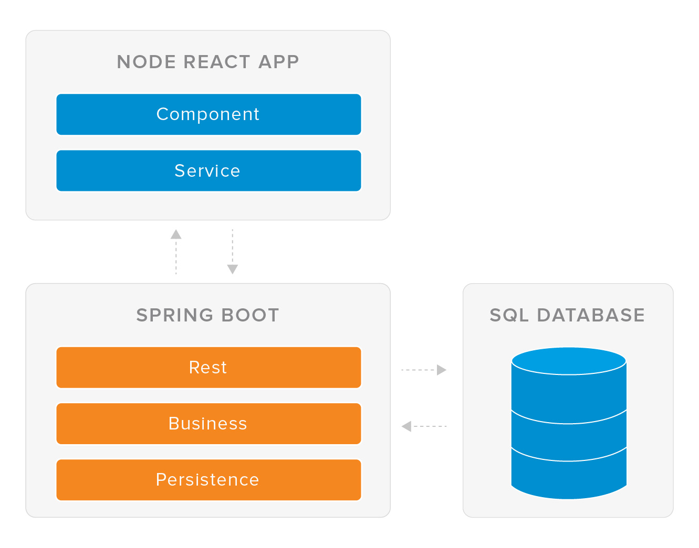

Introduction 
-----------
This is a simple todo management system that can be used as a reference architecture to build a full-stack application. This system is built with the following technologies:

-   [Spring boot](https://spring.io/projects/spring-boot) [server side services]

-   [React.js](https://reactjs.org/) [client side components]

-   [H2](https://www.h2database.com) [relational data]

Prerequisite
-----
Prior to running this application we need to setup our windows environments. Please complete the following installation steps in order: Java, Maven, GIT, Node.js and create-react-app (npm install -g create-react-app)

Note: If you have problems please contact your team mates via Slack.

Project Management
---------------
This project uses an agile methodology. Please see example board at the following link: [https://trello.com/b/msUSX9Vs/todo-board](https://trello.com/b/msUSX9Vs/todo-board)

Architecture
---------------
The following diagram shows the high level reference architecture for the application: 

Running the application
-----
Step 1:
Make a directory for your work and clone the todo project into this directory. Please use the following command:
```
git clone https://github.com/scrappy1987/todo-app.git
```
Step 2:
Open a cmd line in the backend folder and execute the following command:
```
mvn clean install
```
Step 3:
In command window cd into target folder and execute the jar using the following command:
```
java -jar [jar-in-this-folder]
```
Step 4:
From a browser access the API by executing the following HTTP request:
http://localhost:8080/todo
```
The service should return an empty JavaScript array 
```
Step 5:
From a browser access the DB by executing the following HTTP request:
http://localhost:8080/h2-console

Step 6:
Enter the following details and log into the DB:
```
JDBC URL: jdbc:h2:mem:todo
User name: sa
Password: password
```
Step 7:
Enter data into the DB by executing the following SQL statement:
```
INSERT INTO TODO (ID, TODO_NAME) VALUES (1, 'Feed the cat')
```
Step 8:
From a browser access the API by executing the following HTTP request:
http://localhost:8080/todo
```
The service should return an array of TODO objects
```
Step 9:
Open a cmd line in the frontend folder and execute the following command:
```
npm install
```
Step 10:
Next in the cmd line execute the following command:
```
npm start
```
Step 11:
From a browser access the app by executing the following HTTP request:
```
http://localhost:3000
```
Step 12:
From the browser add and remove todo information from the web application. Please observe how this also changes the API and DB.
